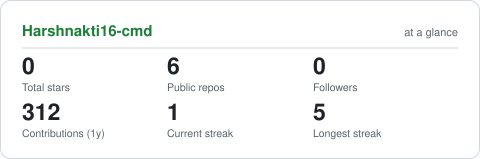
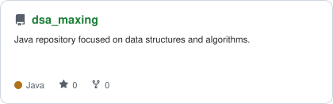
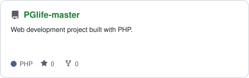

# Hi, I'm Harsh 👋

**Software Developer | Java • Python • React • Flutter**

I enjoy building software, solving problems with data structures and
algorithms, and continuously improving my development skills.

## 🧠 Skills

<picture>
  <source media="(prefers-color-scheme: dark)" srcset="assets/radar-dark.svg">
  <source media="(prefers-color-scheme: light)" srcset="assets/radar-light.svg">
  
</picture>

## 📊 GitHub Stats

<picture>
  <source media="(prefers-color-scheme: dark)" srcset="assets/card-stats-dark.svg">
  <source media="(prefers-color-scheme: light)" srcset="assets/card-stats-light.svg">
  
</picture>

## 🚀 Featured Projects

<picture>
  <source media="(prefers-color-scheme: dark)" srcset="assets/card-dsa_maxing-dark.svg">
  <source media="(prefers-color-scheme: light)" srcset="assets/card-dsa_maxing-light.svg">
  
</picture>

<picture>
  <source media="(prefers-color-scheme: dark)" srcset="assets/card-PGlife-master-dark.svg">
  <source media="(prefers-color-scheme: light)" srcset="assets/card-PGlife-master-light.svg">
  
</picture>

## 📈 GitHub Activity

### Contribution Calendar

### Languages

## 🐍 Contribution Snake

<picture>
  <source media="(prefers-color-scheme: dark)" srcset="https://raw.githubusercontent.com/Harshnakti16-cmd/Harshnakti16-cmd/output/snake-dark.svg">
  <source media="(prefers-color-scheme: light)" srcset="https://raw.githubusercontent.com/Harshnakti16-cmd/Harshnakti16-cmd/output/snake.svg">
  
</picture>
