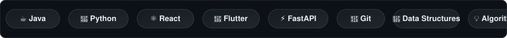

<picture>
  <source media="(prefers-color-scheme: dark)" srcset="assets/header-typing-dark.svg">
  <source media="(prefers-color-scheme: light)" srcset="assets/header-typing-light.svg">
  
</picture>

 

<picture>
  <source media="(prefers-color-scheme: dark)" srcset="assets/marquee-tech-dark.svg">
  <source media="(prefers-color-scheme: light)" srcset="assets/marquee-tech-light.svg">
  
</picture>

 

<table border="0" width="100%">
  <tr>
    <td width="50%" align="center" valign="top">
      <h3 align="left">🧠 Skills</h3>
      <picture>
        <source media="(prefers-color-scheme: dark)" srcset="assets/radar-dark.svg">
        <source media="(prefers-color-scheme: light)" srcset="assets/radar-light.svg">
        
      </picture>
    </td>
    <td width="50%" align="center" valign="top">
      <h3 align="left">📊 GitHub Stats</h3>
      <picture>
        <source media="(prefers-color-scheme: dark)" srcset="assets/card-stats-dark.svg">
        <source media="(prefers-color-scheme: light)" srcset="assets/card-stats-light.svg">
        
      </picture>
    </td>
  </tr>
</table>

## 🚀 Featured Projects

<table border="0" width="100%">
  <tr>
    <td width="50%" align="center" valign="top">
      <picture>
        <source media="(prefers-color-scheme: dark)" srcset="assets/card-dsa_maxing-dark.svg">
        <source media="(prefers-color-scheme: light)" srcset="assets/card-dsa_maxing-light.svg">
        
      </picture>
    </td>
    <td width="50%" align="center" valign="top">
      <picture>
        <source media="(prefers-color-scheme: dark)" srcset="assets/card-PGlife-master-dark.svg">
        <source media="(prefers-color-scheme: light)" srcset="assets/card-PGlife-master-light.svg">
        
      </picture>
    </td>
  </tr>
</table>

## 📈 GitHub Activity

<table border="0" width="100%">
  <tr>
    <td width="50%" align="center" valign="top">
      <h3 align="left">Contribution Calendar</h3>
      
    </td>
    <td width="50%" align="center" valign="top">
      <h3 align="left">Languages</h3>
      
    </td>
  </tr>
</table>

## 🐍 Contribution Snake

<picture>
  <source media="(prefers-color-scheme: dark)" srcset="https://raw.githubusercontent.com/Harshnakti16-cmd/Harshnakti16-cmd/output/snake-dark.svg">
  <source media="(prefers-color-scheme: light)" srcset="https://raw.githubusercontent.com/Harshnakti16-cmd/Harshnakti16-cmd/output/snake.svg">
  
</picture>
